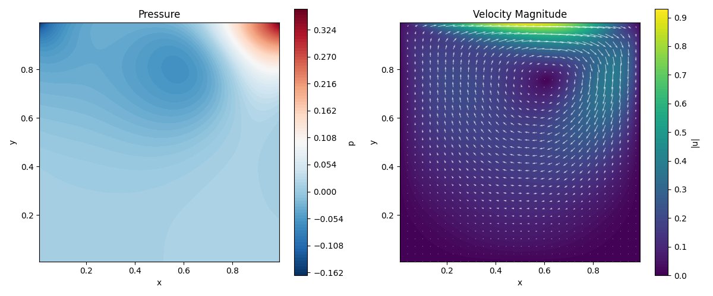
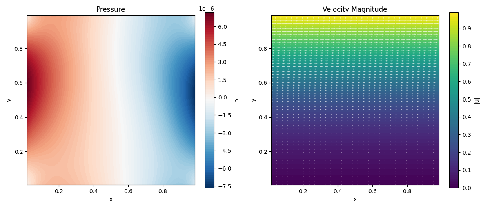
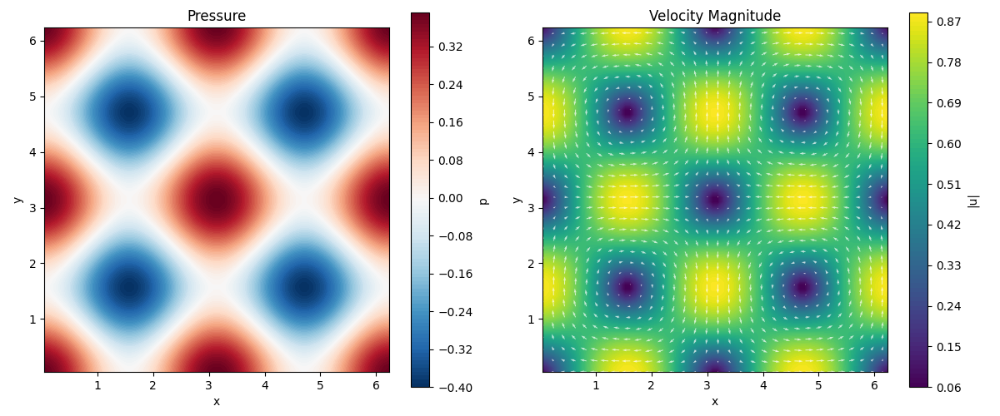

# Example Gallery

Results from bundled simulation examples. Each example has a `config.yaml` and
`run.py` in its directory under `examples/`.

For detailed validation results, error analysis, and convergence studies, see
[VALIDATION.md](VALIDATION.md).

---

## Lid-Driven Cavity

A lid moves at constant velocity over a square cavity. The classic benchmark
for incompressible Navier-Stokes solvers.

- **Grid:** 64x64, dt=0.001, nu=0.01
- **BCs:** Smooth sinusoidal lid (top), no-slip walls on remaining sides
- **Physics:** Steady-state recirculation with corner vortices at high Re



```bash
python examples/cavity/run.py
```

See [VALIDATION.md](VALIDATION.md#lid-driven-cavity) for Ghia benchmark comparison.

---

## Couette Flow

Flow between two infinite parallel plates: bottom at rest, top moving at U=1.0.
The bundled case uses periodic x boundaries, so there is no imposed streamwise
pressure gradient. The velocity field evolves from rest toward the linear
steady Couette profile.

**Important:** the default `simulation_time` is 10 s, while the viscous
diffusion time is `H^2/nu = 100 s`. Therefore the bundled image is a
**transient** solution, not a steady-state solution. Its nonlinear-looking
vertical profile is expected at this time. The pressure should remain spatially
constant up to numerical roundoff.

- **Grid:** 32x64, dt=0.001, nu=0.01
- **BCs:** No-slip top/bottom, periodic left/right
- **Transient analytical solution:** Fourier series from rest
- **Steady-state analytical solution:** u(y) = U * y / H
- **Diffusion:** explicit (periodic Crank-Nicolson is not yet implemented)



```bash
python examples/couette/run.py
```

See [VALIDATION.md](VALIDATION.md#couette-flow) for analytical solution comparison.

---

## Taylor-Green Vortex

A decaying 2D vortex in a periodic domain. The analytical solution is known
exactly, making it ideal for convergence studies.

- **Grid:** 64x64, dt=0.001, nu=0.01
- **BCs:** Free-slip top/bottom, periodic left/right
- **Domain:** [0, 2pi] x [0, 2pi]
- **Analytical:** u(x,y,t) = -U0 sin(kx*x) cos(ky*y) exp(-d*t), d = nu*(kx^2+ky^2)
- **L2 error at t=2s:** 3.8e-2

### Grid convergence

| Grid | L2 error | Linf error |
|------|----------|------------|
| 16x16 | 6.9e-2 | 1.4e-1 |
| 32x32 | 3.9e-2 | 7.9e-2 |
| 64x64 | 2.0e-2 | 4.2e-2 |
| 128x128 | 1.0e-2 | 2.1e-2 |

Error halves with each refinement (second-order convergence).



```bash
python examples/taylor_green/run.py
```

See [VALIDATION.md](VALIDATION.md#taylor-green-vortex) for exact solution comparison and convergence study.

---

## Channel Flow (Poiseuille)

Pressure-driven flow between two parallel plates. Can be driven by a body
force or by inlet/outlet BCs.

- **Config variants:** `config_body_force.yaml`, `config_inlet.yaml`
- **Analytical:** Parabolic profile u(y) = (4*U_max/H^2) * y * (H - y)

```bash
python examples/channel_flow/run.py --variant body-force
python examples/channel_flow/run.py --variant inlet
```

See [VALIDATION.md](VALIDATION.md#channel-flow-poiseuille) for parabolic profile comparison.
