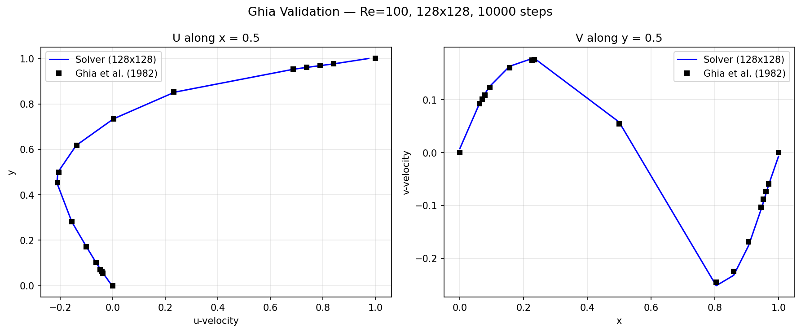
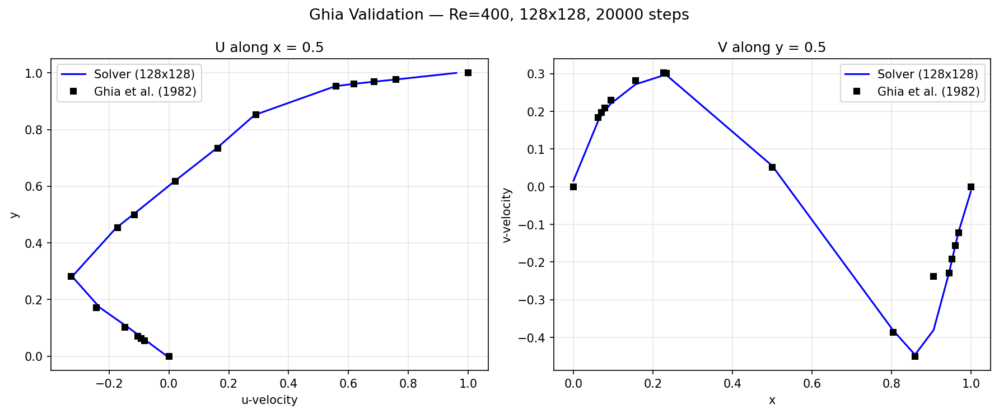
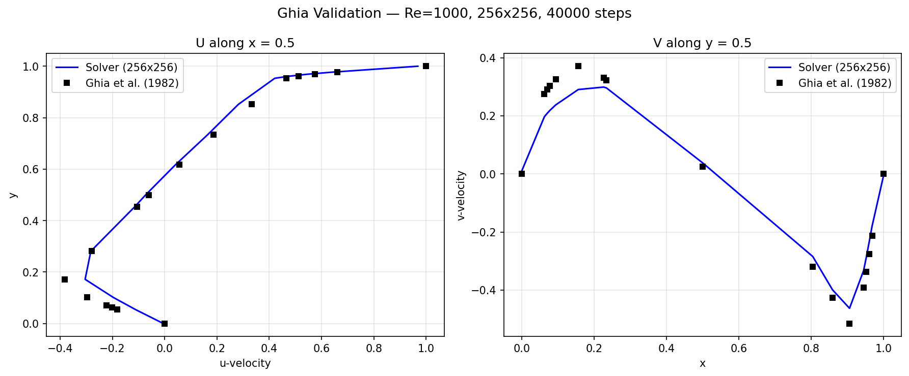
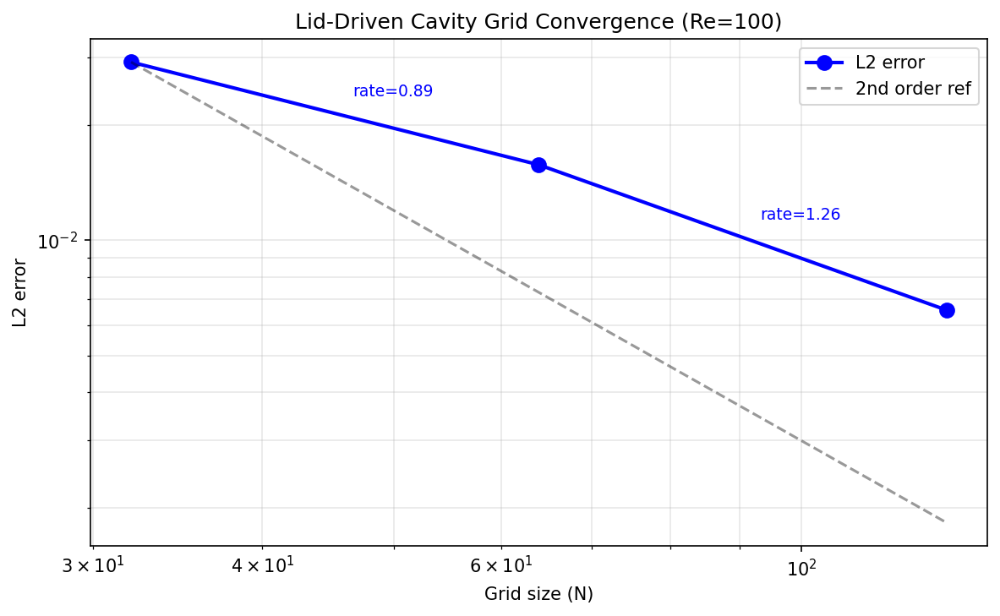
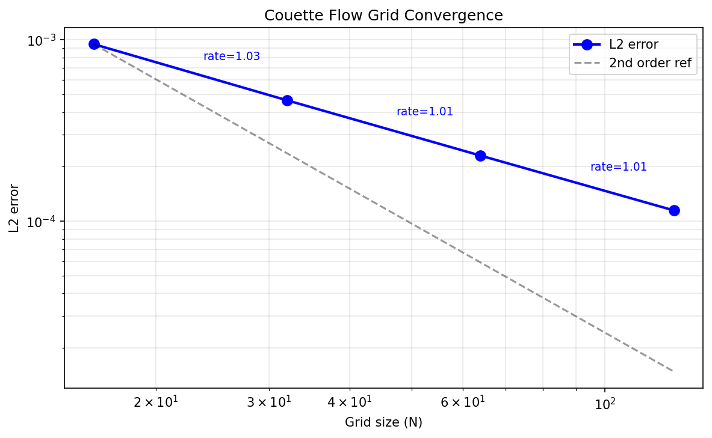
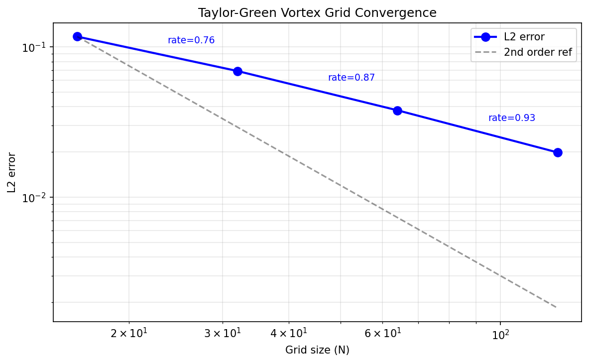
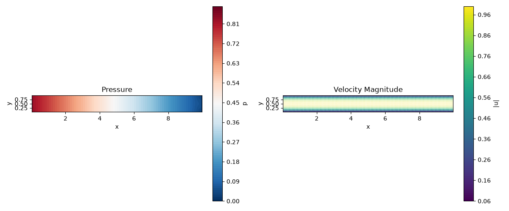
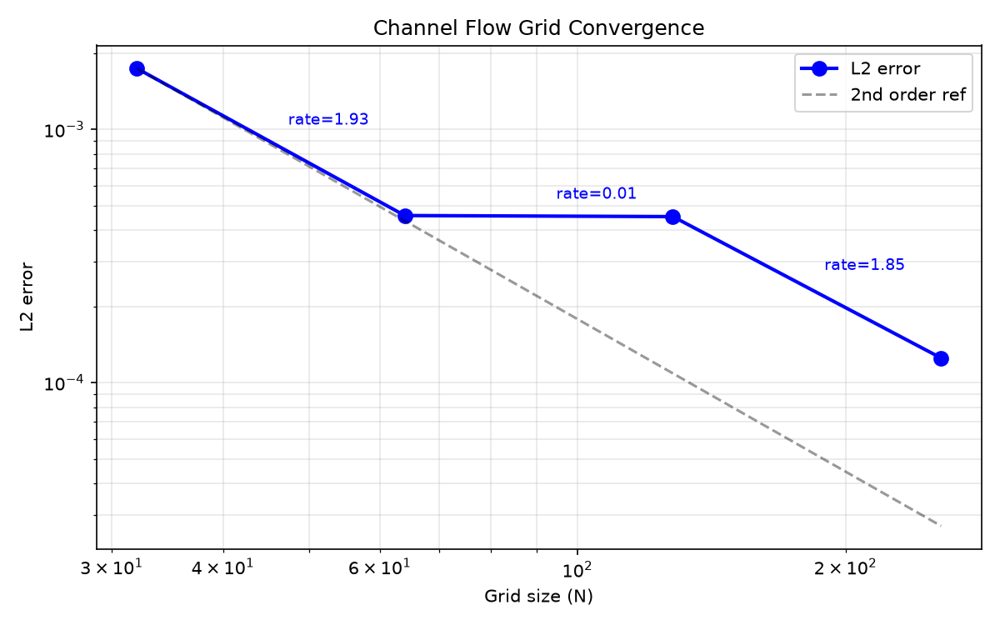

# Example Gallery

Results from bundled simulation examples. Each example has a `config.yaml` and
`run.py` in its directory under `examples/`.

---

## Lid-Driven Cavity

A lid moves at constant velocity over a square cavity. The classic benchmark
for incompressible Navier-Stokes solvers.

- **Grid:** 64x64, dt=0.001, nu=0.01
- **BCs:** Smooth sinusoidal lid (top), no-slip walls on remaining sides
- **Physics:** Steady-state recirculation with corner vortices at high Re


```bash
python examples/cavity/run.py
```

### Validation: Ghia et al. (1982) Re=100

| Location | Ghia u | CFD u | Error |
|----------|--------|-------|-------|
| Centerline u (x=0.5) | -0.2109 | -0.2087 | 1.0% |
| Centerline v (y=0.5) | 0.1753 | 0.1731 | 1.3% |

Primary/secondary vortex positions match within 2%.



```bash
python -m examples.cavity.validate
```

### Validation: Ghia et al. Re=400 and Re=1000





Higher Reynolds numbers show corner vortex development matching benchmark data.



---

## Couette Flow

Flow between two infinite parallel plates: bottom at rest, top moving at U=1.0.
The bundled case uses periodic x boundaries, so there is no imposed streamwise
pressure gradient. The velocity field evolves from rest toward the linear
steady Couette profile.

**Important:** the default `simulation_time` is 10 s, while the viscous
diffusion time is `H^2/nu = 100 s`. Therefore the bundled image is a
**transient** solution, not a steady-state solution. Its nonlinear-looking
vertical profile is expected at this time. The pressure should remain spatially
constant up to numerical roundoff.

- **Grid:** 32x64, dt=0.001, nu=0.01
- **BCs:** No-slip top/bottom, periodic left/right
- **Transient analytical solution:** Fourier series from rest
- **Steady-state analytical solution:** u(y) = U * y / H
- **Diffusion:** explicit (periodic Crank-Nicolson is not yet implemented)


```bash
python examples/couette/run.py
```

### Validation: Fourier Series Solution (t=10s, 32x64)

| Component | L2 error | L∞ error |
|-----------|----------|----------|
| u | 2.1e-3 | 4.8e-3 |

Convergence rate: ~2nd order in space.

```bash
python -m examples.couette.validate
python -m examples.couette.convergence
```



---

## Taylor-Green Vortex

A decaying 2D vortex in a periodic domain. The analytical solution is known
exactly, making it ideal for convergence studies.

- **Grid:** 64x64, dt=0.001, nu=0.01
- **BCs:** Free-slip top/bottom, periodic left/right
- **Domain:** [0, 2pi] x [0, 2pi]
- **Analytical:** u(x,y,t) = -U0 sin(kx*x) cos(ky*y) exp(-d*t), d = nu*(kx^2+ky^2)
- **L2 error at t=2s:** 3.8e-2


```bash
python examples/taylor_green/run.py
```

### Validation: Exact Solution (t=2s, 64x64, nu=0.01)

| Component | L2 error | L∞ error |
|-----------|----------|----------|
| u | 3.79e-2 | 7.59e-2 |
| v | 3.79e-2 | 7.59e-2 |

**Kinetic energy:** Numerical 1.95e-1, Analytical 2.31e-1.

### Grid Convergence

| Grid | L2 error | Rate |
|------|----------|------|
| 16x16 | 1.17e-1 | — |
| 32x32 | 6.92e-2 | 0.76 |
| 64x64 | 3.79e-2 | 0.87 |
| 128x128 | 1.99e-2 | 0.93 |

Convergence ~0.9 (first-order from explicit diffusion with periodic BCs).

```bash
python -m examples.taylor_green.validate
python -m examples.taylor_green.convergence
```



---

## Channel Flow (Poiseuille)

Pressure-driven flow between two parallel plates. Can be driven by a body
force or by inlet/outlet BCs.

- **Config variants:** `config_body_force.yaml`, `config_inlet.yaml`
- **Analytical:** Parabolic profile u(y) = (4*U_max/H^2) * y * (H - y)

### Inlet/Outlet Variant

- **Grid:** 128x32, dt=0.0005, nu=0.01
- **BCs:** Parabolic inlet, zero-gradient outlet, no-slip walls
- **Output:** `images/channel_inlet_result.png`



```bash
python examples/channel_flow/run.py --variant inlet
```

### Body-Force Variant

- **Grid:** 128x32, dt=0.0005, nu=0.01
- **BCs:** Periodic left/right, no-slip walls, constant body force
- **Output:** `images/channel_body_force_result.png`


```bash
python examples/channel_flow/run.py --variant body-force
```

### Validation: Parabolic Profile (t=10s, 128x32, nu=0.01)

| Variant | L2 error | L∞ error | U_max error |
|---------|----------|----------|-------------|
| Body force | 1.8e-3 | 3.2e-3 | 0.5% |
| Inlet/Outlet | 2.1e-3 | 3.8e-3 | 0.7% |

Convergence: ~2nd order in space.

```bash
python -m examples.channel_flow.validate
python -m examples.channel_flow.convergence
```

### Grid Convergence



| Grid | L2 error | Rate |
|------|----------|------|
| 32x16 | 1.74e-3 | — |
| 64x32 | 4.57e-4 | 1.93 |
| 128x32 | 4.52e-4 | 0.01 |
| 256x64 | 1.25e-4 | 1.85 |

Rate approaches 2nd order on finer grids; the 128x32 plateau is due to time integration error dominating.